Design decisions:
* Server should not send to a client any data that the corresponding player is not supposed to see. This will prevent cheating by means of a modified client.
* Server should explicitly send all data relevant to a client, even if the data can be figured out on the client side. Rationale: avoid game logic duplication with a cost of slightly higher network traffic.
* Every state change on server side happens in two steps: 1) pending notifications for all players are added to the state and persisted; 2) when all players confirm reception of the notifications, server persists the next state and clears all pending notifications. This allows to restore the state gracefully in case any connection gets broken or any participant goes down: it is guaranteed that every player sees every update (not just gets up-to-date state when reconnected).

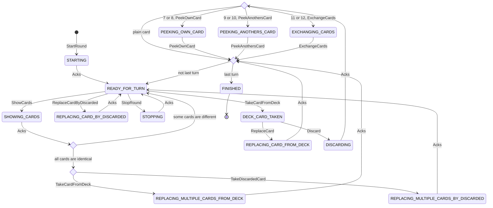

### Phase A (round start)

Start a new round:
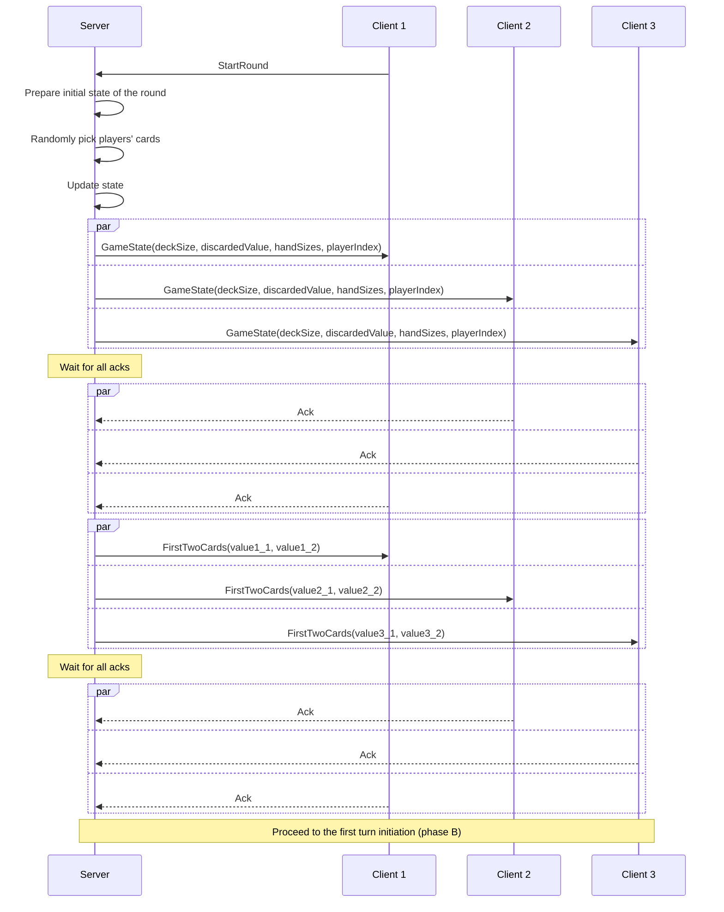

### Phase B (turn initiation)

Initiate a turn (select random player for the first one, the 2nd player is selected here):
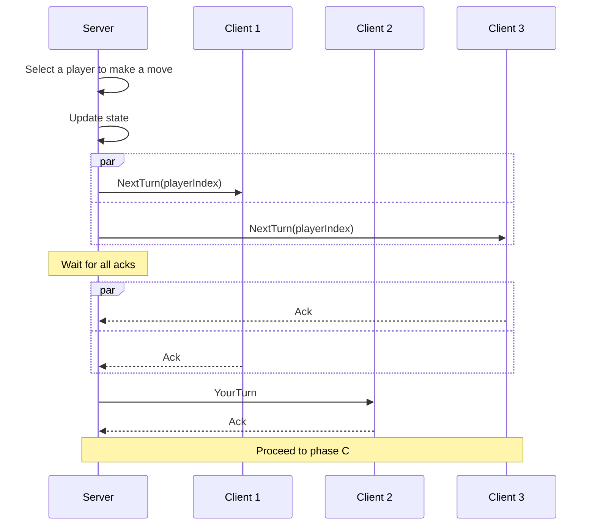

### Phase C (selection, identity testing, or stopping)

Pick card from deck:
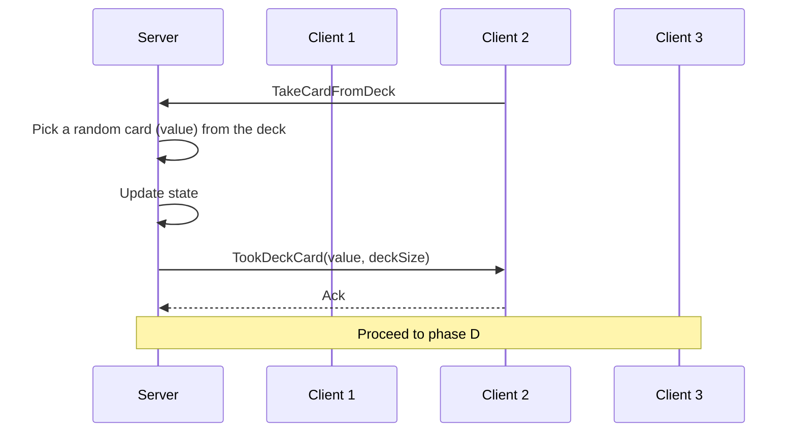

Replace a card in hand by the topmost discarded card:
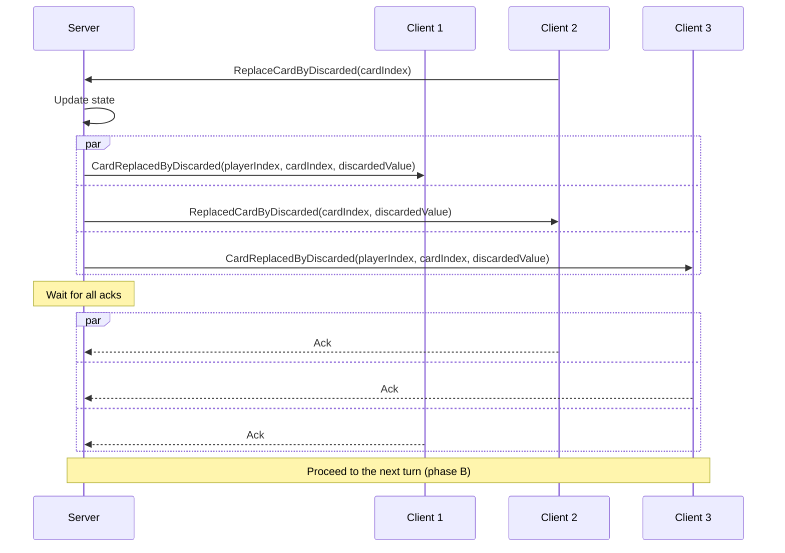

Claim to have two or more identical cards and succeed:
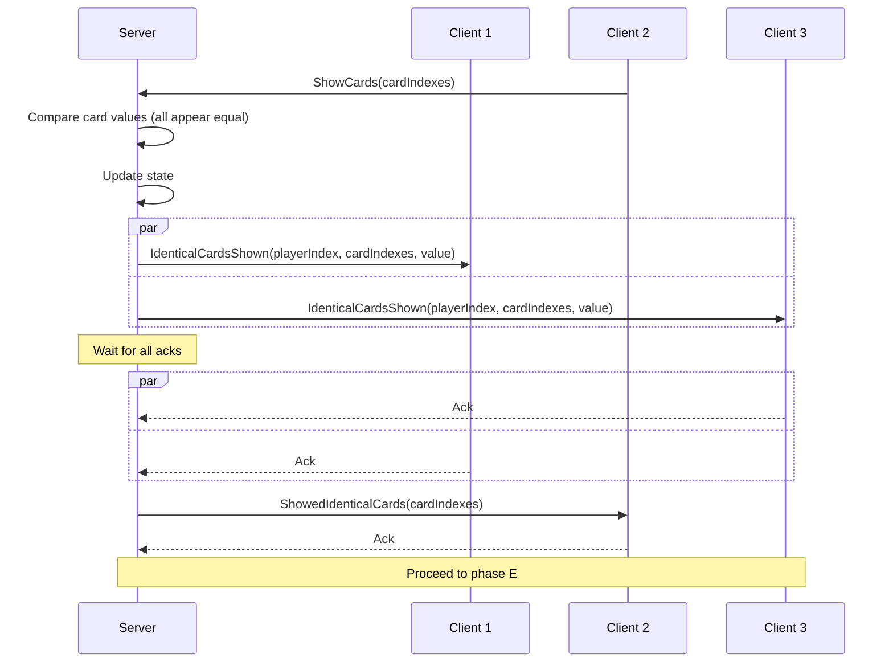

Claim to have two or more identical cards and fail:
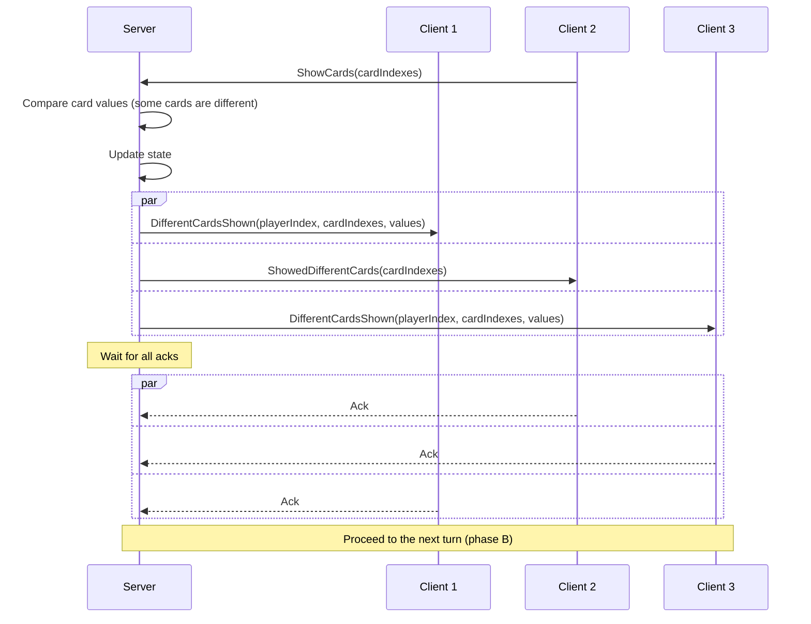

Stop the round:
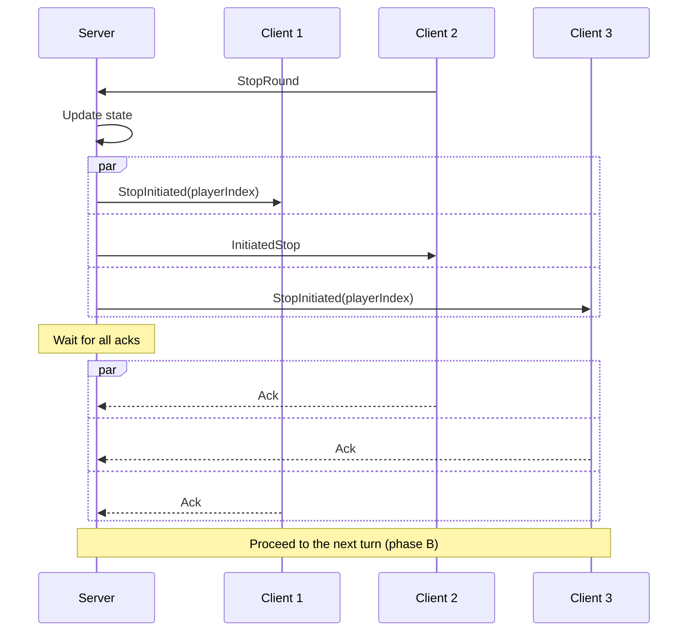

### Phase D (action)

Replace a card in player's hand by the picked card:
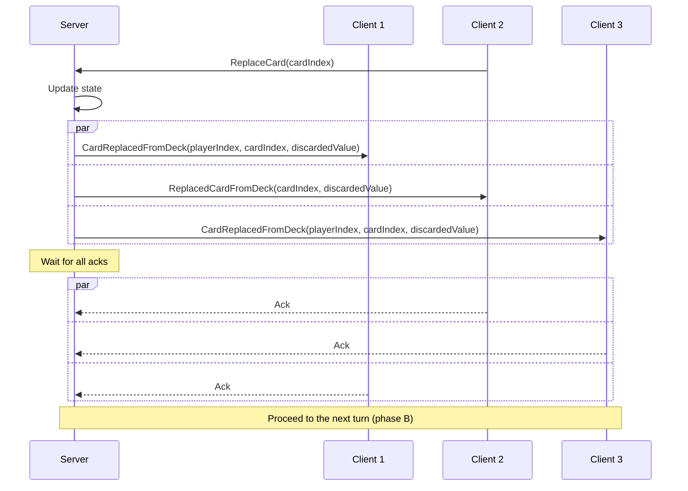

Discard the picked card (simple):
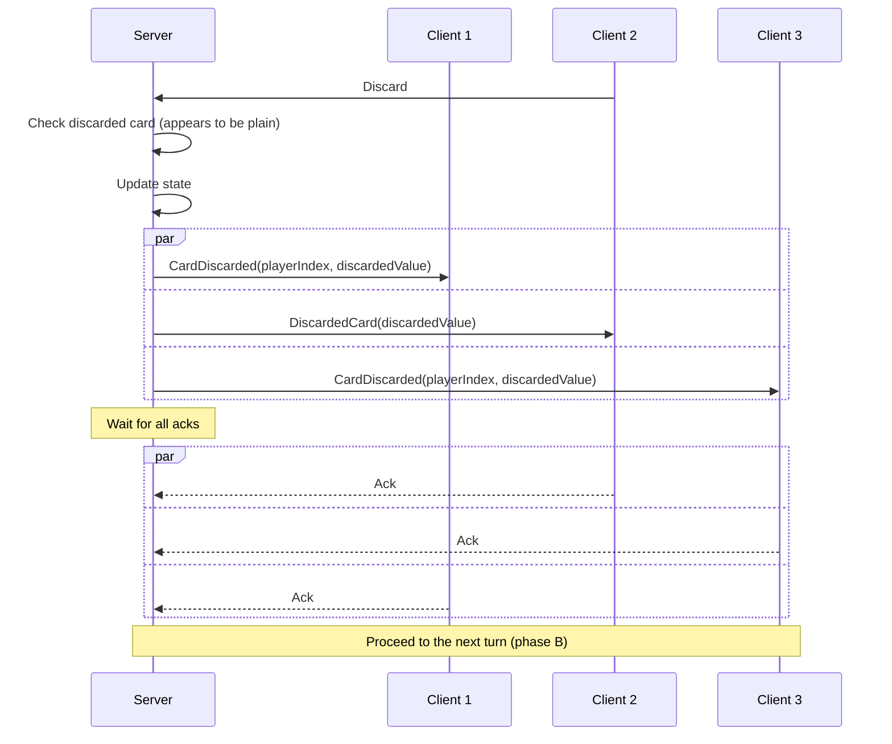

Discard the picked card (7 or 8):
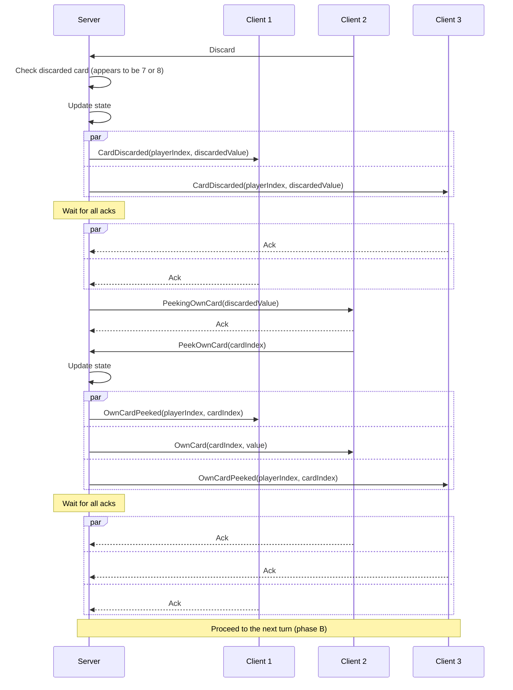

Discard the picked card (9 or 10):
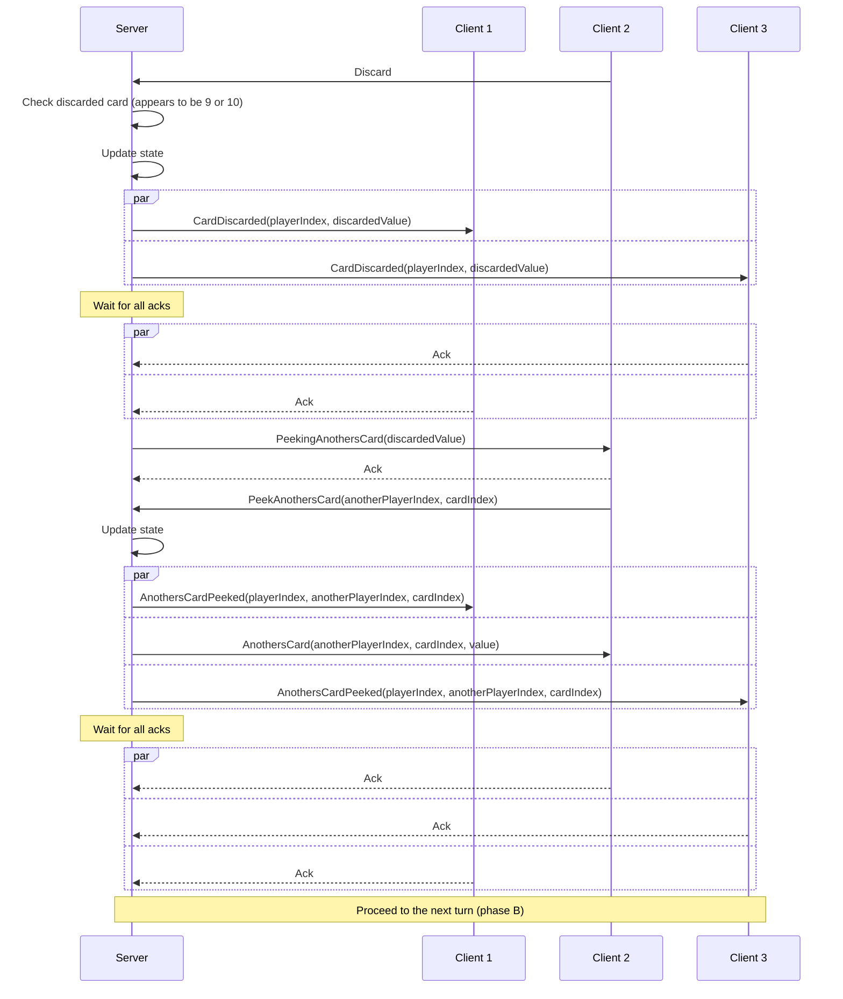

Discard the picked card (11 or 12):
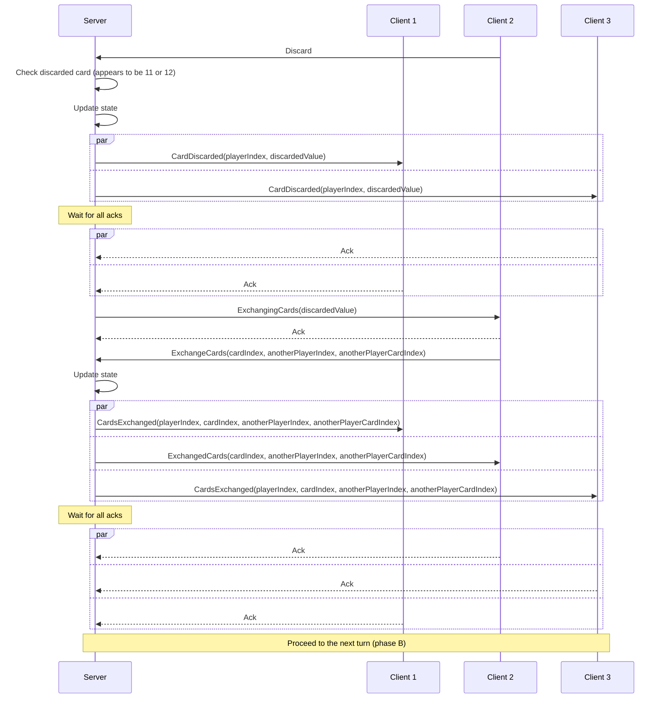

### Phase E (multiple cards replacement)

Replace multiple cards with a card from deck:

Replace multiple cards with a discarded card:

