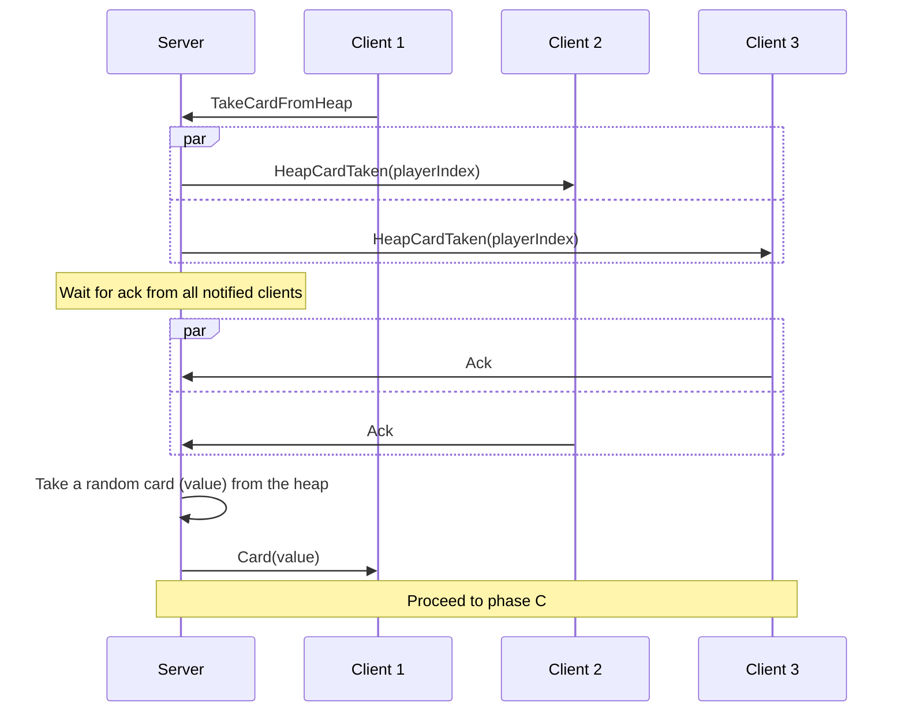
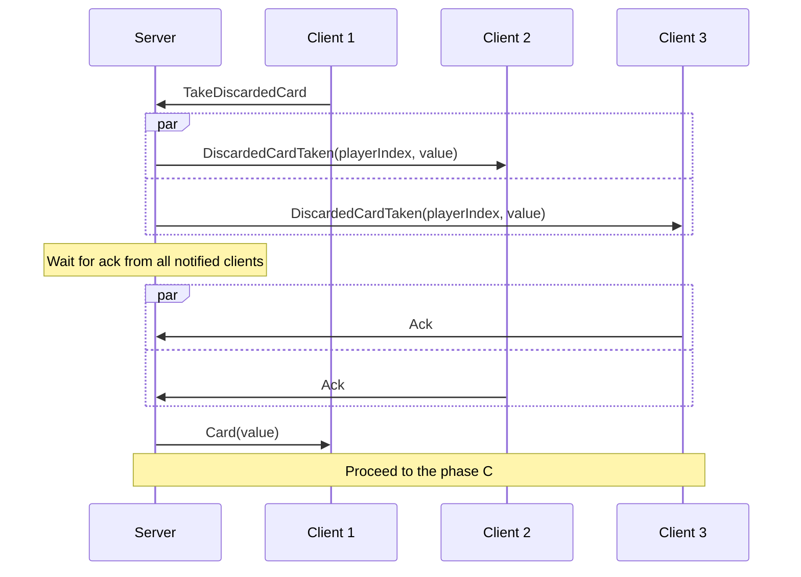
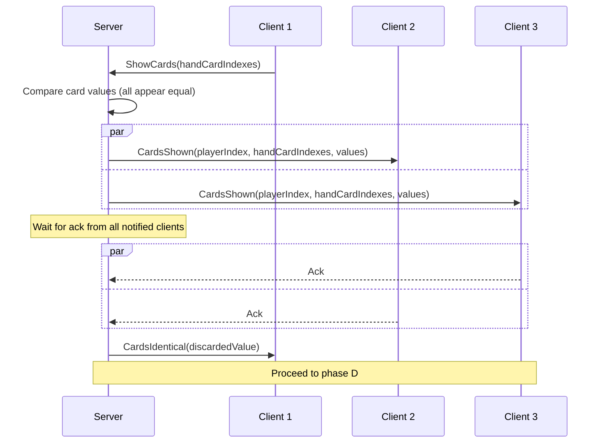
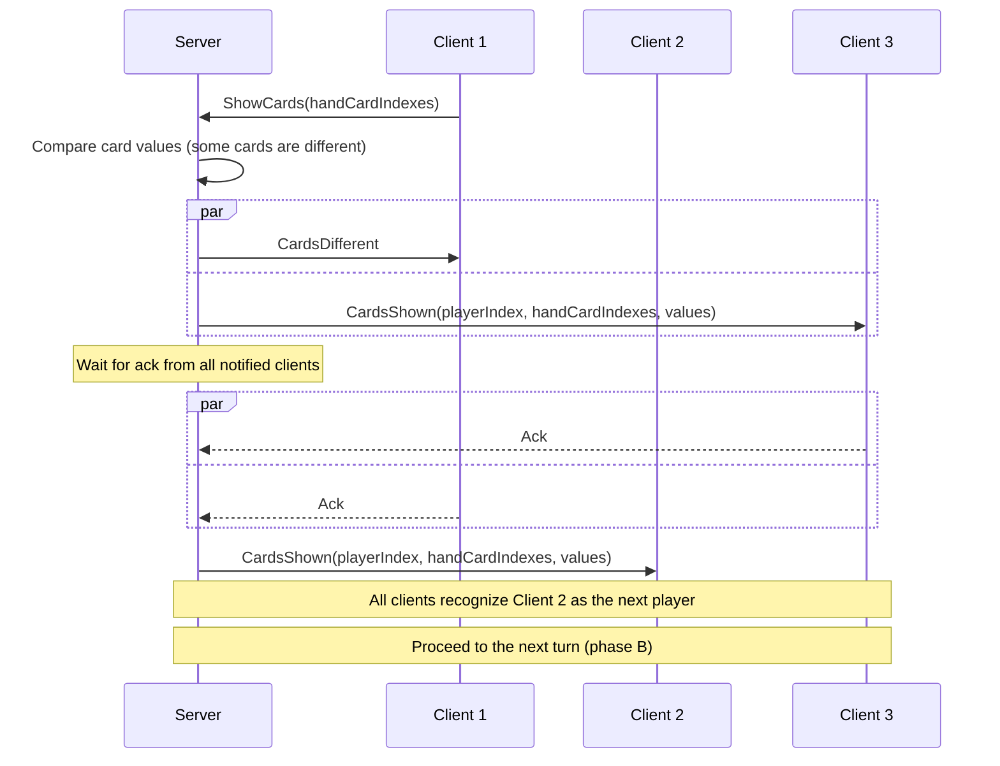
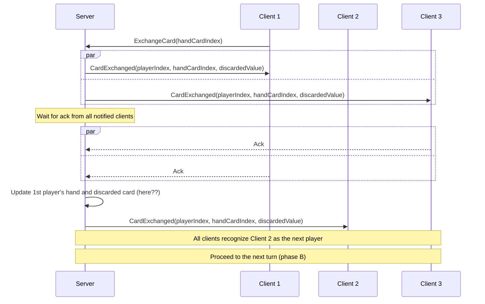
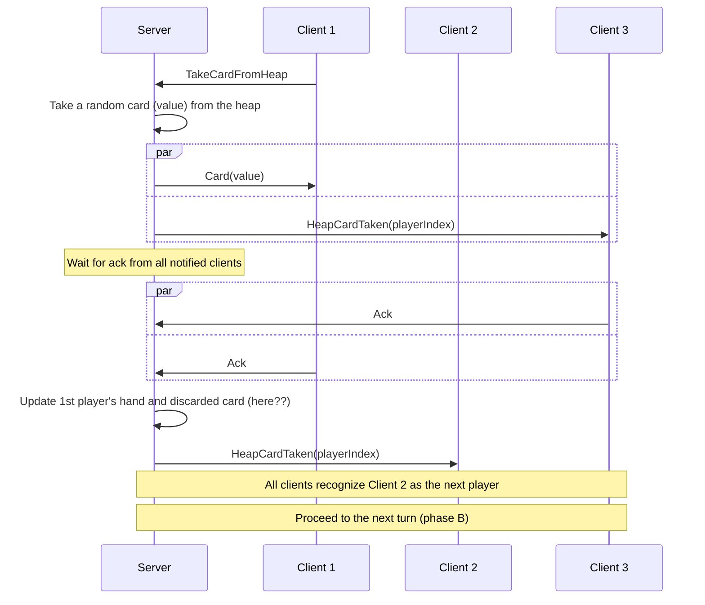
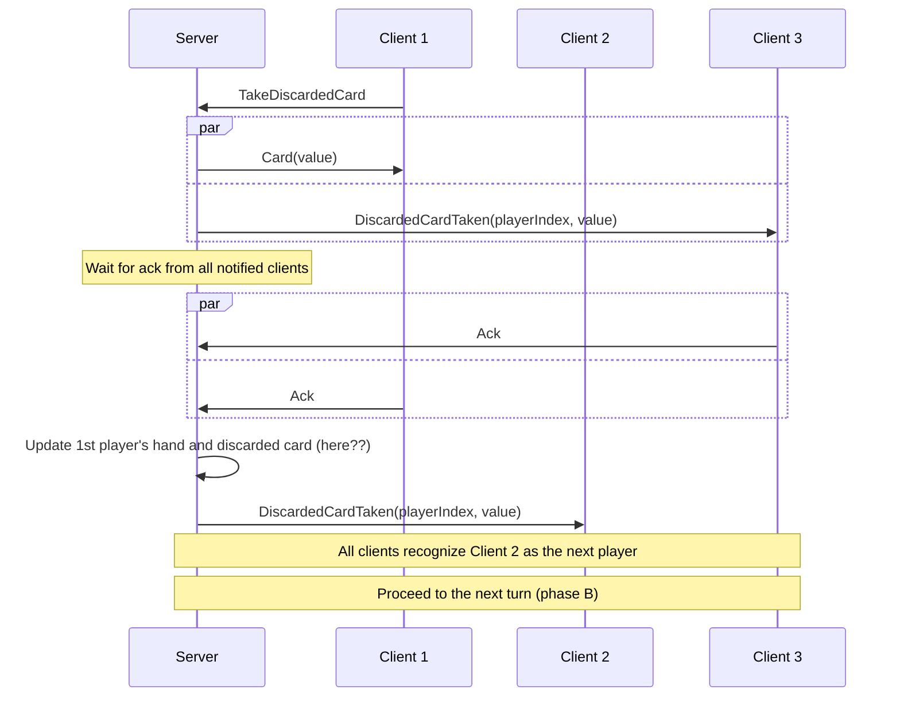

### Phase A (round start)

Start a new round:

### Phase B (selection, identity testing, or stopping)

Pick card from heap:

Pick topmost discarded card (for exchange):

Claim to have two or more identical cards and succeed:

Claim to have two or more identical cards and fail:

### Phase C (action)

Exchange the picked card with a card in player's hand:

Discard the picked card (simple):

Discard the picked card (7 or 8):

Discard the picked card (9 or 10):

Discard the picked card (11 or 12):

### Phase D (multiple cards replacement)

Replace multiple cards with a card from heap:

Replace multiple cards with a discarded card:

