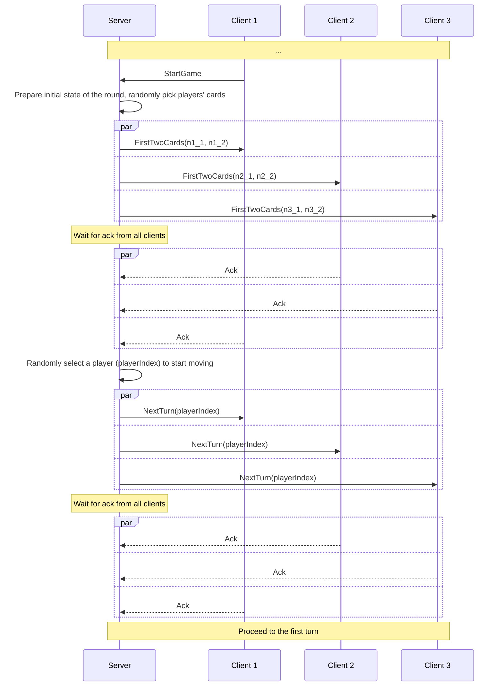
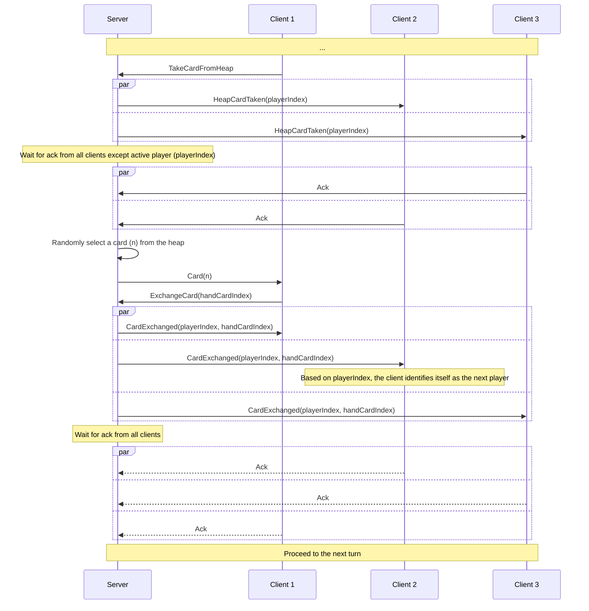

# another

```mermaid
sequenceDiagram
    participant S as Server
    participant C1 as Client 1
    participant C2 as Client 2
    participant C3 as Client 3
    Note over S,C3: ...
    C1->>S: StartGame
    S->>S: Prepare initial state of the round, randomly pick players' cards
    par
        S->>C1: FirstTwoCards(n1_1, n1_2)
    and
        S->>C2: FirstTwoCards(n2_1, n2_2)
    and
        S->>C3: FirstTwoCards(n3_1, n3_2)
    end
    Note over S: Wait for ack from all clients
    par
        C2-->>S: Ack
    and
        C3-->>S: Ack
    and
        C1-->>S: Ack
    end
    S->>S: Randomly select a player (playerIndex) to start moving
    par
        S->>C1: NextTurn(playerIndex)
    and
        S->>C2: NextTurn(playerIndex)
    and
        S->>C3: NextTurn(playerIndex)
    end
    Note over S: Wait for ack from all clients
    par
        C2-->>S: Ack
    and
        C3-->>S: Ack
    and
        C1-->>S: Ack
    end
    Note over S,C3: Proceed to the first turn
```

```mermaid
sequenceDiagram
    participant S as Server
    participant C1 as Client 1
    participant C2 as Client 2
    participant C3 as Client 3
    Note over S,C3: ...
    C1->>S: TakeCardFromHeap
    par
        S->>C2: HeapCardTaken(playerIndex)
    and
        S->>C3: HeapCardTaken(playerIndex)
    end
    Note over S: Wait for ack from all clients except active player (playerIndex)
    par
        C3->>S: Ack
    and
        C2->>S: Ack
    end
    S->>S: Randomly select a card (n) from the heap
    S->>C1: Card(n)
    C1->>S: ExchangeCard(handCardIndex)
    par
        S->>C1: CardExchanged(playerIndex, handCardIndex)
    and
        S->>C2: CardExchanged(playerIndex, handCardIndex)
        Note over C2: Based on playerIndex, the client identifies itself as the next player
    and
        S->>C3: CardExchanged(playerIndex, handCardIndex)
    end
    Note over S: Wait for ack from all clients
    par
        C2-->>S: Ack
    and
        C3-->>S: Ack
    and
        C1-->>S: Ack
    end
    Note over S,C3: Proceed to the next turn
```
