Design decisions:
* Server should not send to a client any data that the corresponding player is not supposed to see. This will prevent cheating by means of a modified client.
* Server should explicitly send all data relevant to a client, even if the data can be figured out on the client side. Rationale: avoid game logic duplication with a cost of slightly higher network traffic.

### Phase A (round start)

Start a new round:
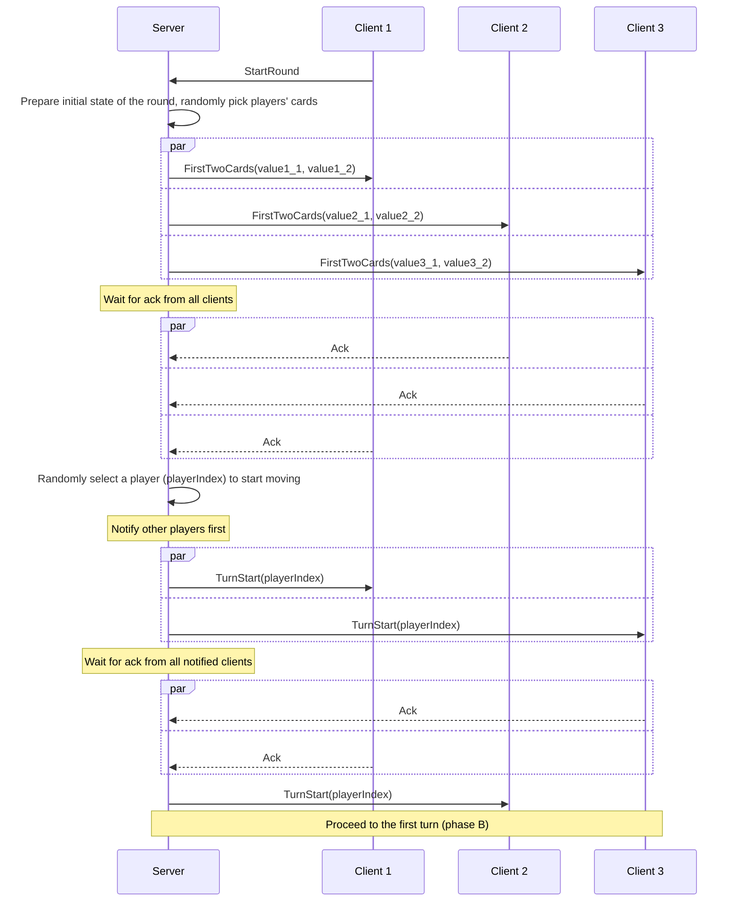

### Phase B (selection, identity testing, or stopping)

Pick card from heap:
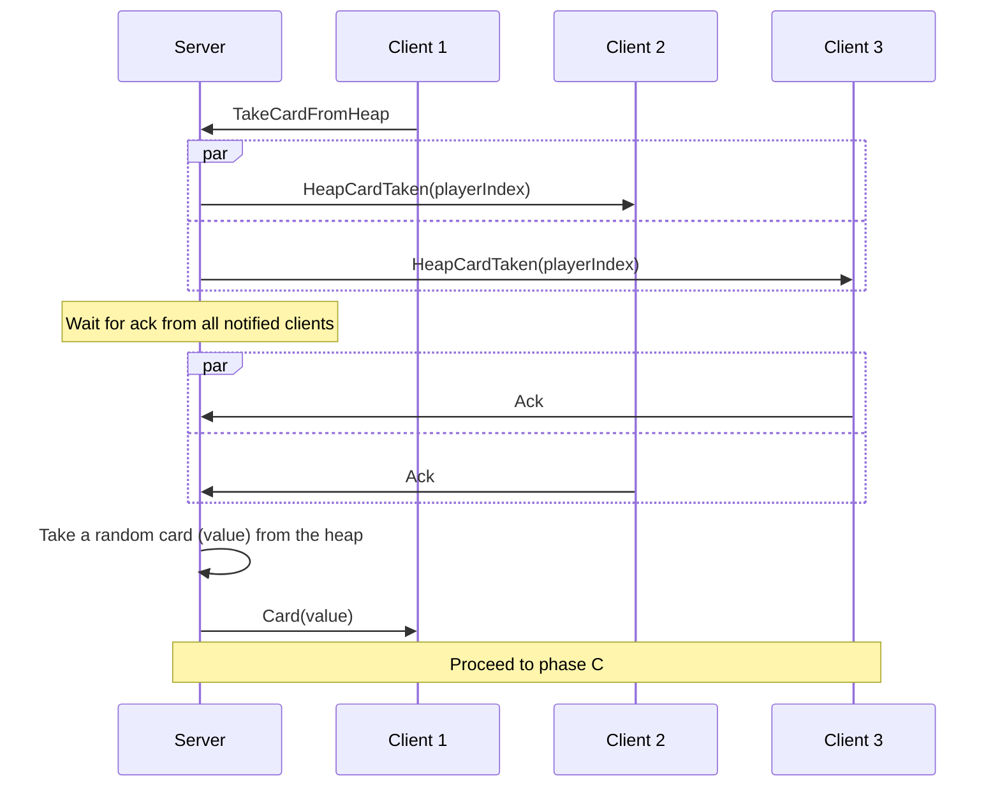

Replace a card in hand by the topmost discarded card:
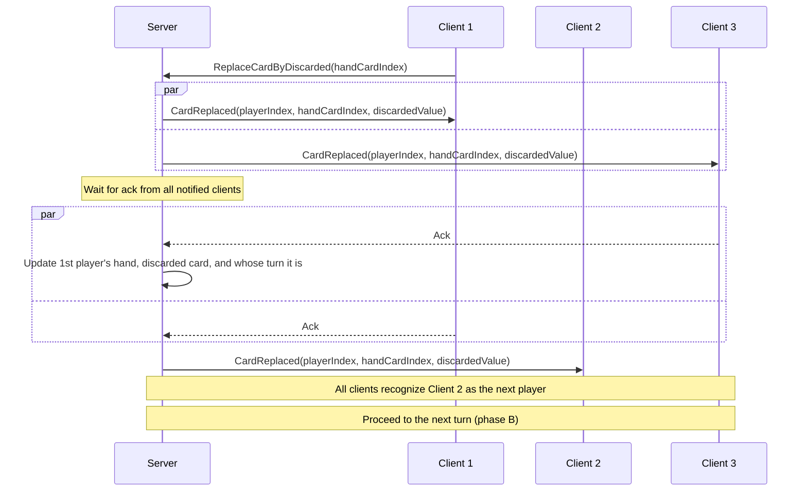

Claim to have two or more identical cards and succeed:
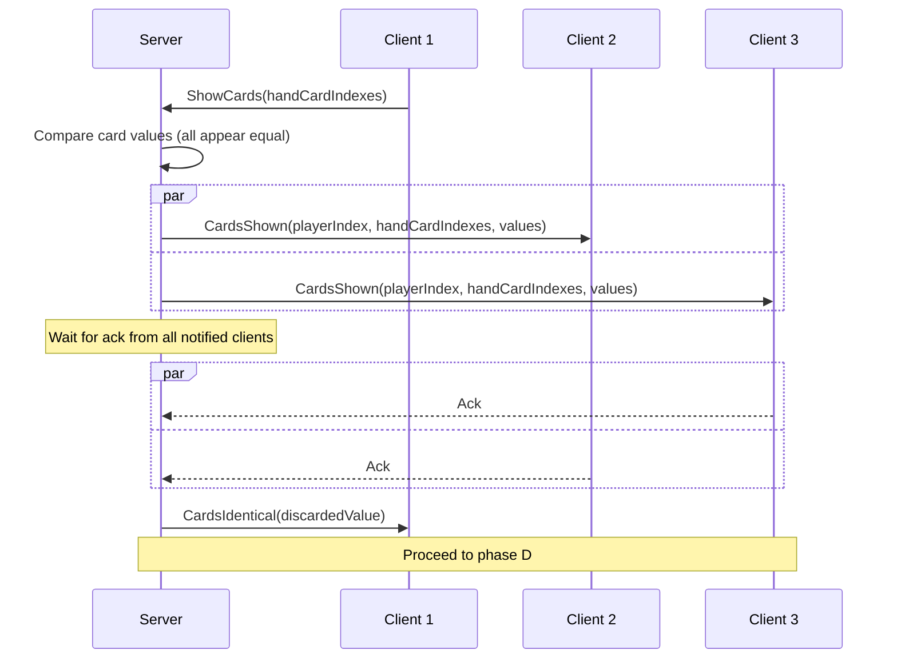

Claim to have two or more identical cards and fail:
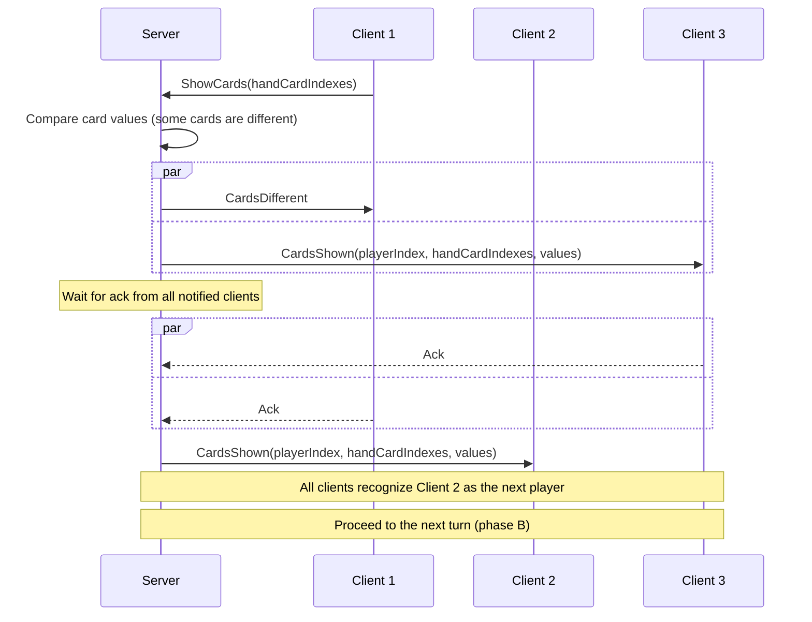

Stop the round:
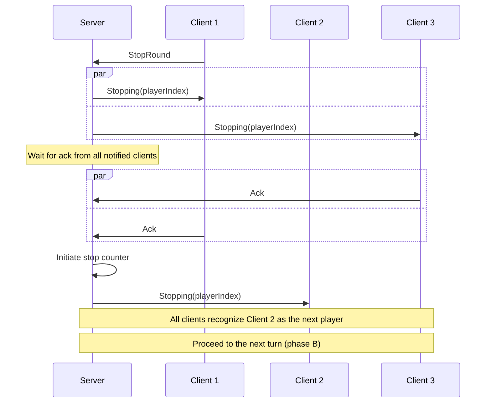

### Phase C (action)

Replace a card in player's hand by the picked card:
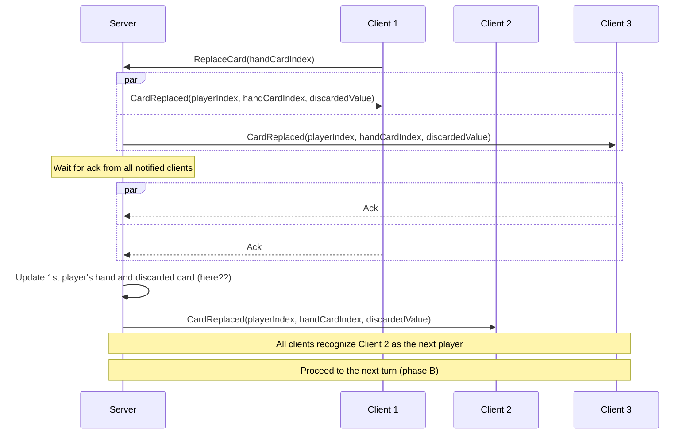

Discard the picked card (simple):
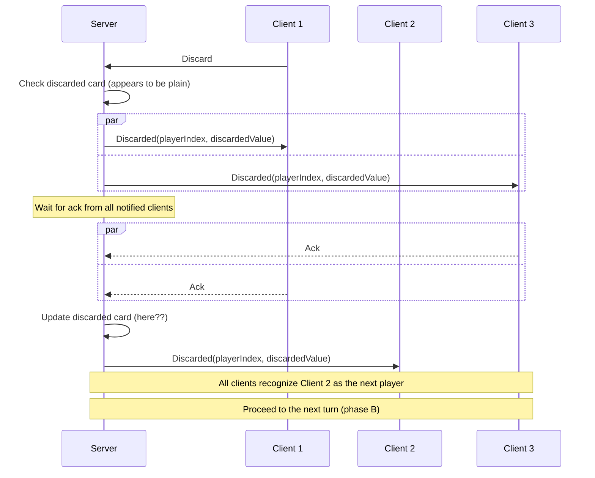

Discard the picked card (7 or 8):
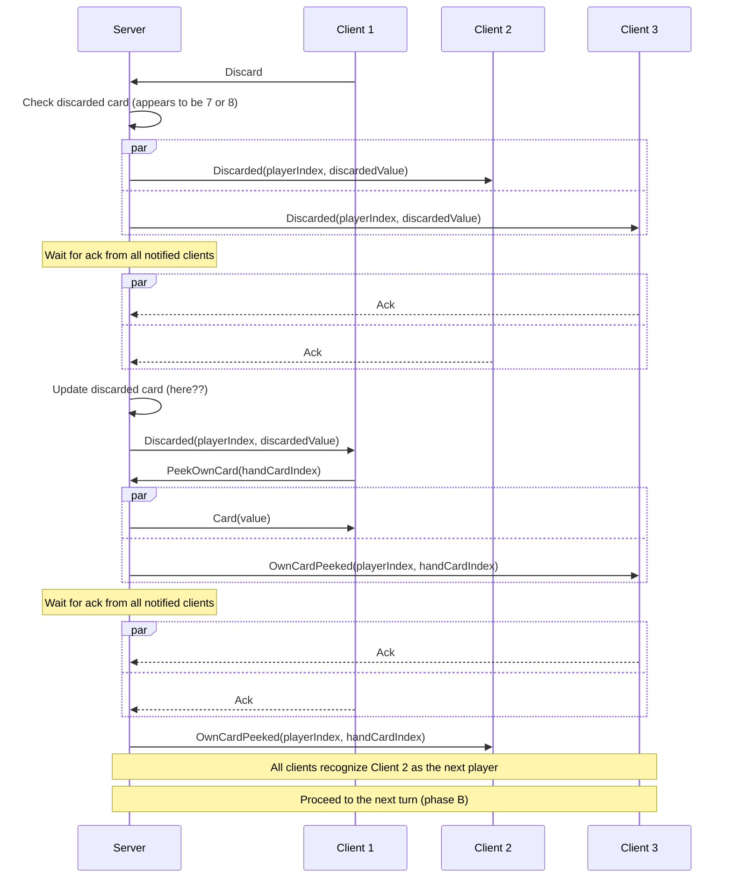

Discard the picked card (9 or 10):
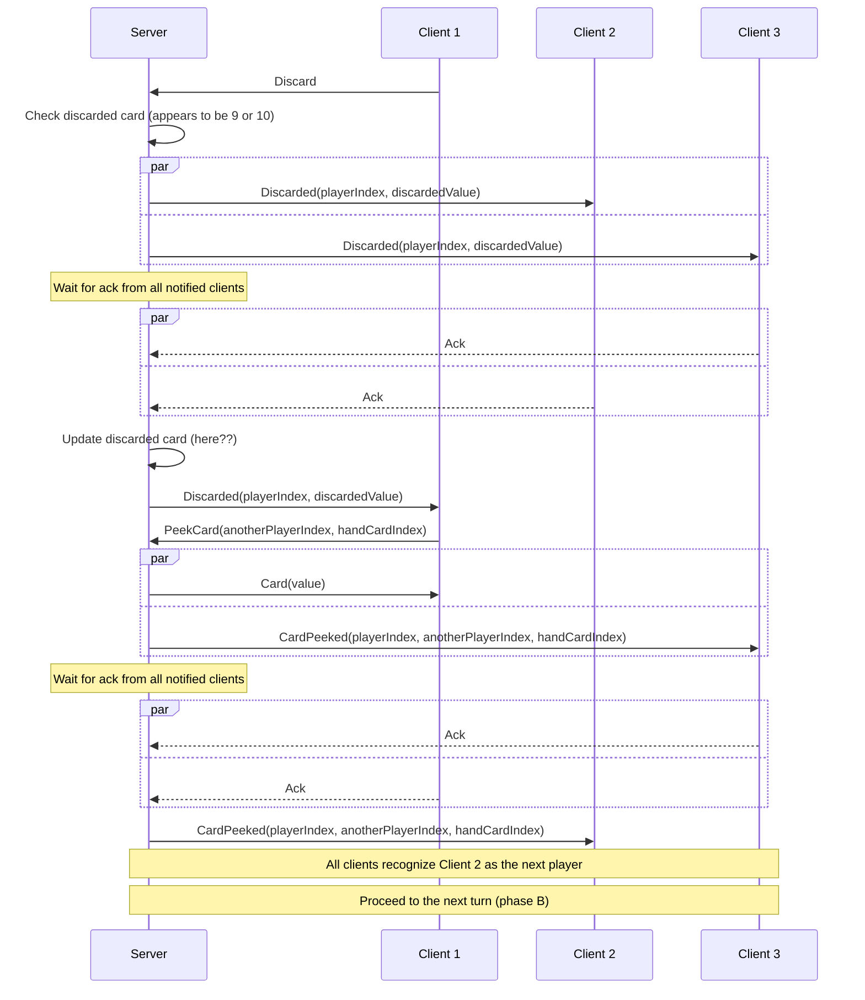

Discard the picked card (11 or 12):
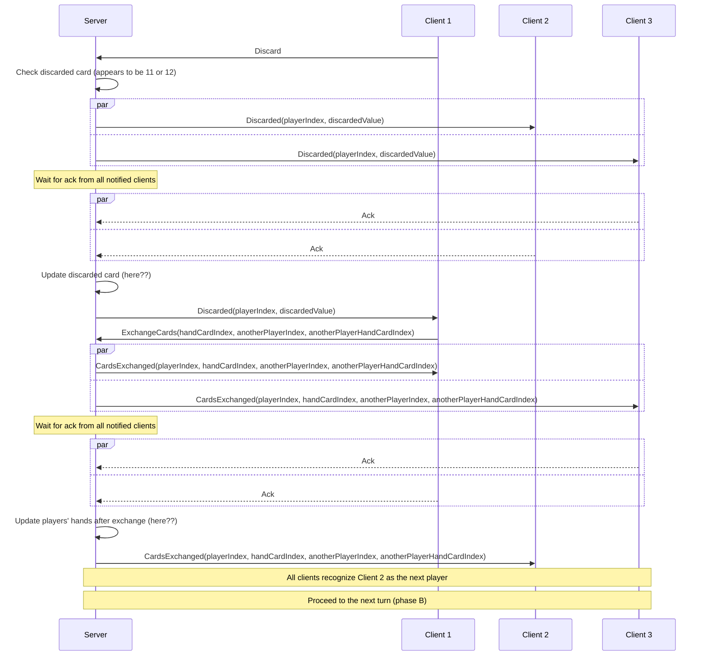

### Phase D (multiple cards replacement)

Replace multiple cards with a card from heap:
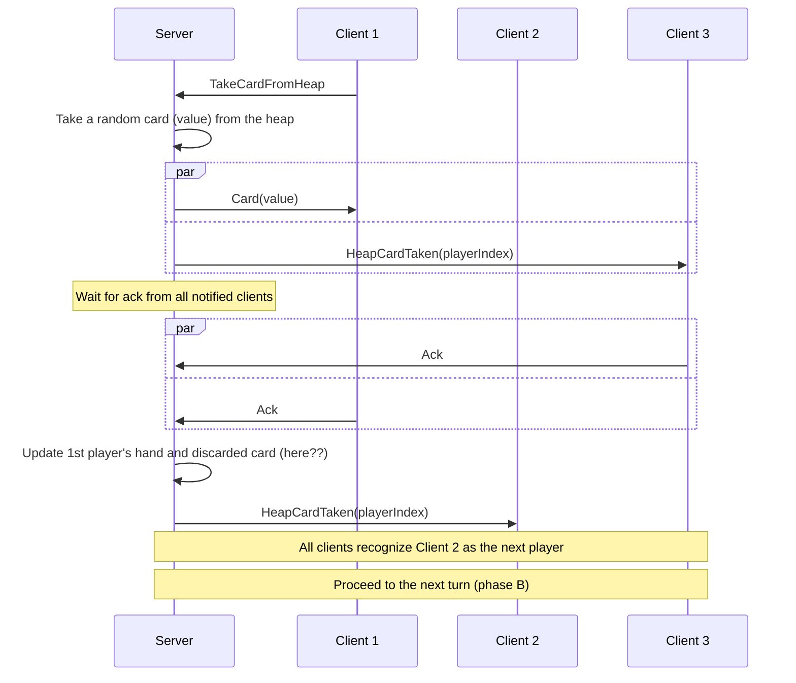

Replace multiple cards with a discarded card:
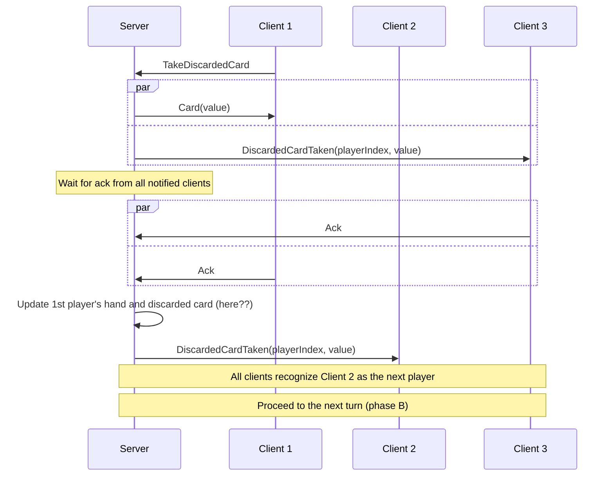
