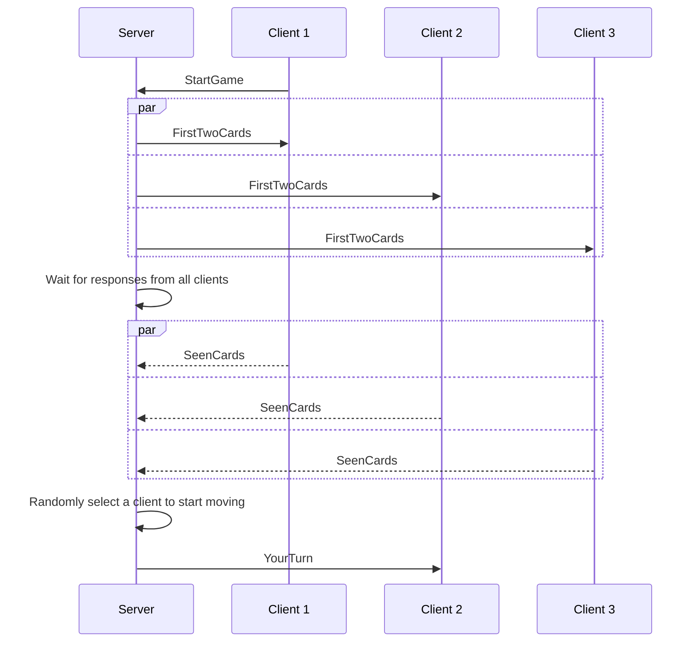

# another

```mermaid
sequenceDiagram
    participant S as Server
    participant C1 as Client 1
    participant C2 as Client 2
    participant C3 as Client 3
    C1->>S: StartGame
    par
        S->>C1: FirstTwoCards
    and
        S->>C2: FirstTwoCards
    and
        S->>C3: FirstTwoCards
    end
    S->>S: Wait for responses from all clients
    par
        C1-->>S: SeenCards
    and
        C2-->>S: SeenCards
    and
        C3-->>S: SeenCards
    end
    S->>S: Randomly select a client to start moving
    S->>C2: YourTurn
```

