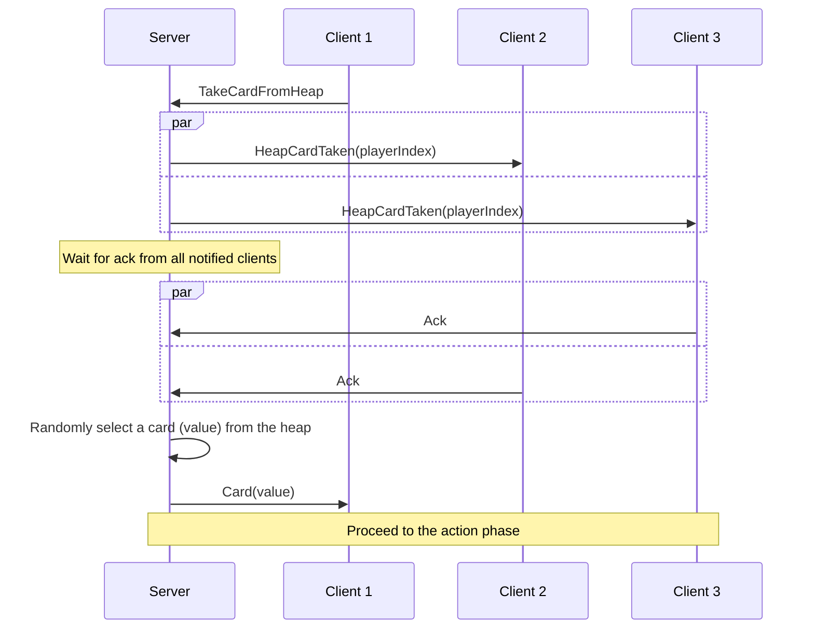
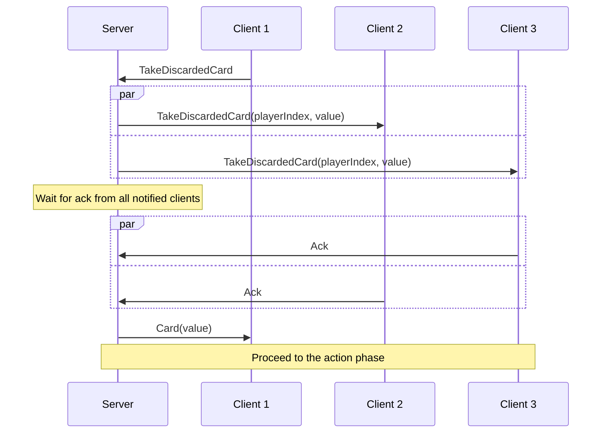
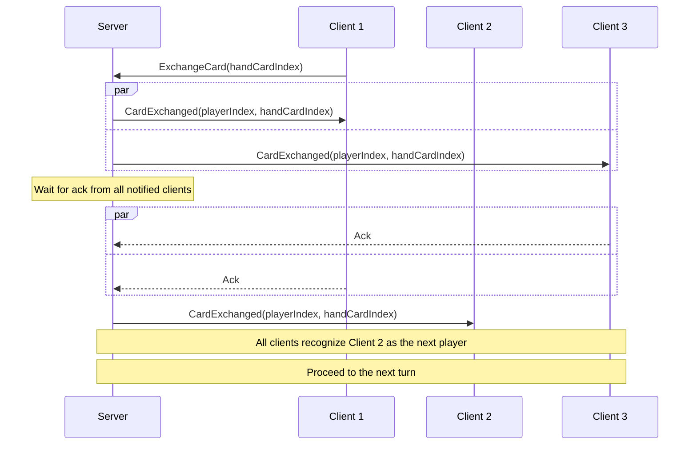

# another

Start a new round:

```mermaid
sequenceDiagram
    participant S as Server
    participant C1 as Client 1
    participant C2 as Client 2
    participant C3 as Client 3
    C1->>S: StartRound
    S->>S: Prepare initial state of the round, randomly pick players' cards
    par
        S->>C1: FirstTwoCards(value1_1, value1_2)
    and
        S->>C2: FirstTwoCards(value2_1, value2_2)
    and
        S->>C3: FirstTwoCards(value3_1, value3_2)
    end
    Note over S: Wait for ack from all clients
    par
        C2-->>S: Ack
    and
        C3-->>S: Ack
    and
        C1-->>S: Ack
    end
    S->>S: Randomly select a player (playerIndex) to start moving
    Note over S: Notify other players first
    par
        S->>C1: FirstTurn(playerIndex)
    and
        S->>C3: FirstTurn(playerIndex)
    end
    Note over S: Wait for ack from all notified clients
    par
        C3-->>S: Ack
    and
        C1-->>S: Ack
    end
    S->>C2: FirstTurn(playerIndex)
    Note over S,C3: Proceed to the first turn
```

Pick card from heap:

```mermaid
sequenceDiagram
    participant S as Server
    participant C1 as Client 1
    participant C2 as Client 2
    participant C3 as Client 3
    C1->>S: TakeCardFromHeap
    par
        S->>C2: HeapCardTaken(playerIndex)
    and
        S->>C3: HeapCardTaken(playerIndex)
    end
    Note over S: Wait for ack from all notified clients
    par
        C3->>S: Ack
    and
        C2->>S: Ack
    end
    S->>S: Randomly select a card (value) from the heap
    S->>C1: Card(value)
    Note over S,C3: Proceed to the action phase
```

Pick topmost discarded card:

```mermaid
sequenceDiagram
    participant S as Server
    participant C1 as Client 1
    participant C2 as Client 2
    participant C3 as Client 3
    C1->>S: TakeDiscardedCard
    par
        S->>C2: TakeDiscardedCard(playerIndex, value)
    and
        S->>C3: TakeDiscardedCard(playerIndex, value)
    end
    Note over S: Wait for ack from all notified clients
    par
        C3->>S: Ack
    and
        C2->>S: Ack
    end
    S->>C1: Card(value)
    Note over S,C3: Proceed to the action phase
```

Exchange the picked card with a card in player's hand:

```mermaid
sequenceDiagram
    participant S as Server
    participant C1 as Client 1
    participant C2 as Client 2
    participant C3 as Client 3
    C1->>S: ExchangeCard(handCardIndex)
    par
        S->>C1: CardExchanged(playerIndex, handCardIndex)
    and
        S->>C3: CardExchanged(playerIndex, handCardIndex)
    end
    Note over S: Wait for ack from all notified clients
    par
        C3-->>S: Ack
    and
        C1-->>S: Ack
    end
    S->>C2: CardExchanged(playerIndex, handCardIndex)
    Note over S,C3: All clients recognize Client 2 as the next player
    Note over S,C3: Proceed to the next turn
```

