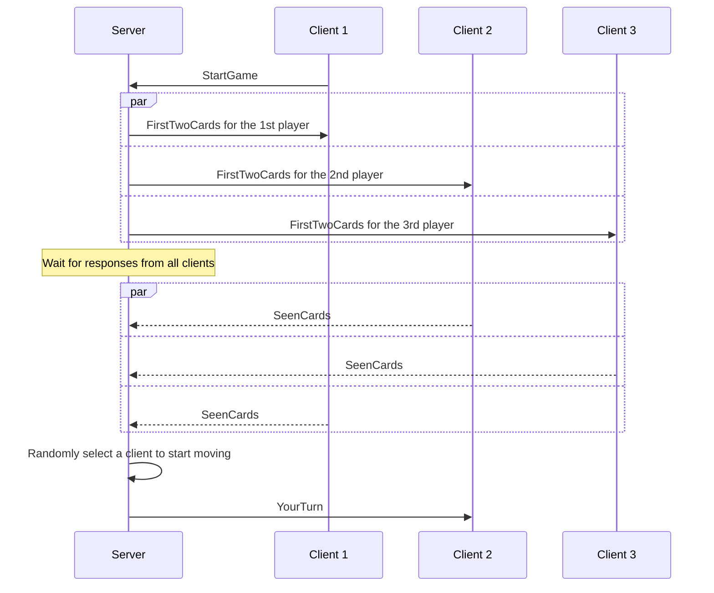

# another



```mermaid
sequenceDiagram
    participant S as Server
    participant C1 as Client 1
    participant C2 as Client 2
    participant C3 as Client 3
    S->>C2: YourTurn
    C2->>S: TakeCardFromHeap
    S->>C2: Card
    par
        S->>C1,C3: HeapCardTaken
    and
        S->>C3: HeapCardTaken
    end
```