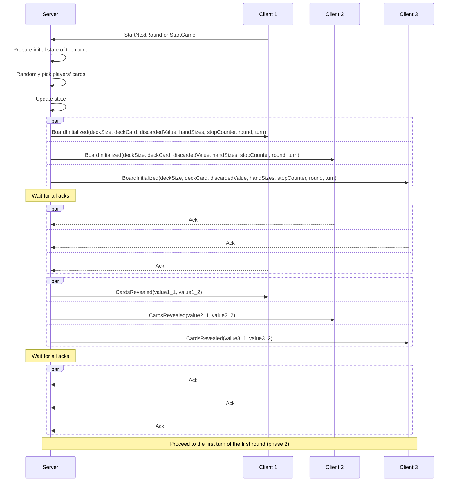
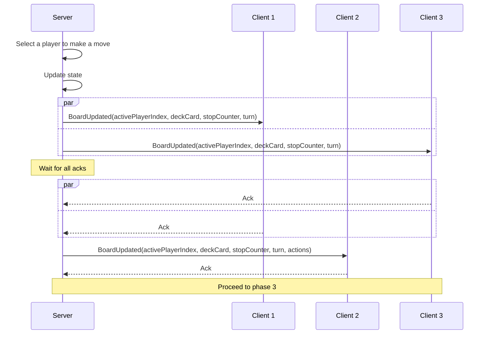
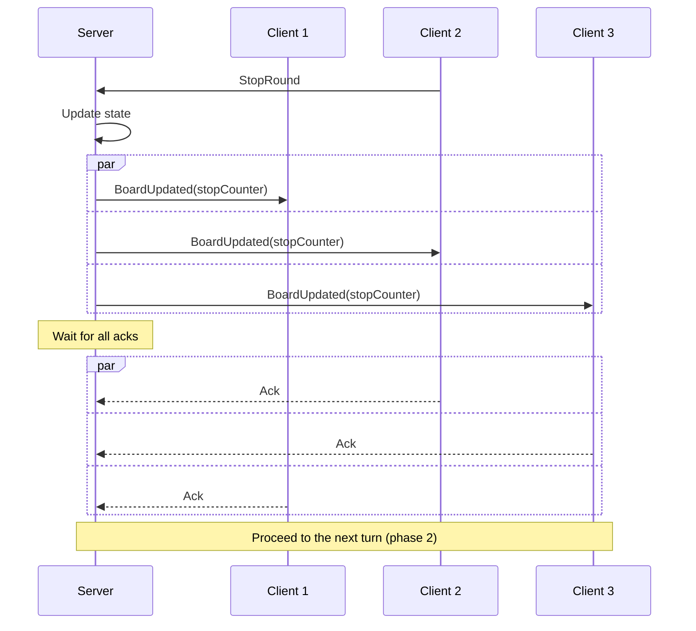
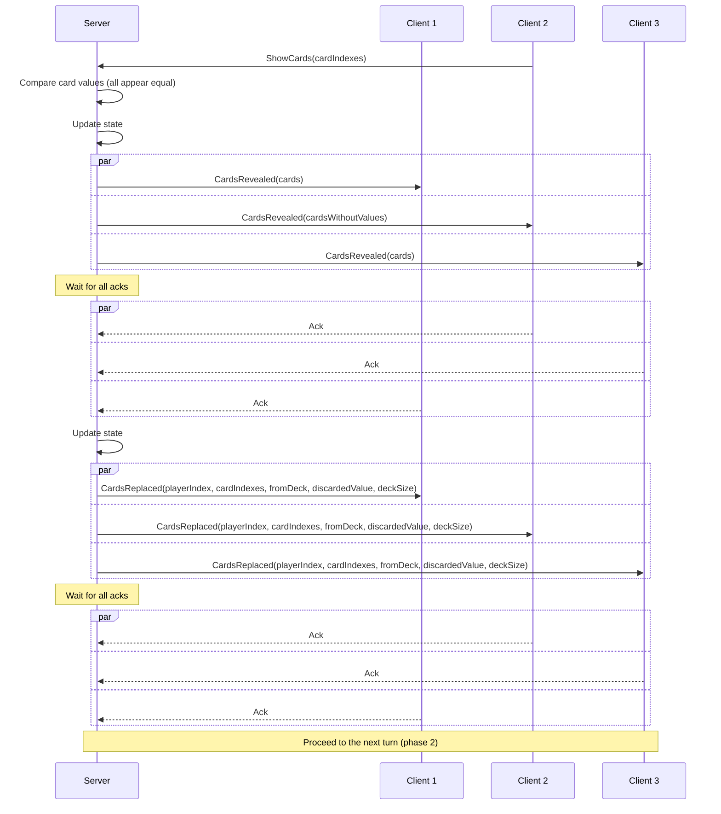
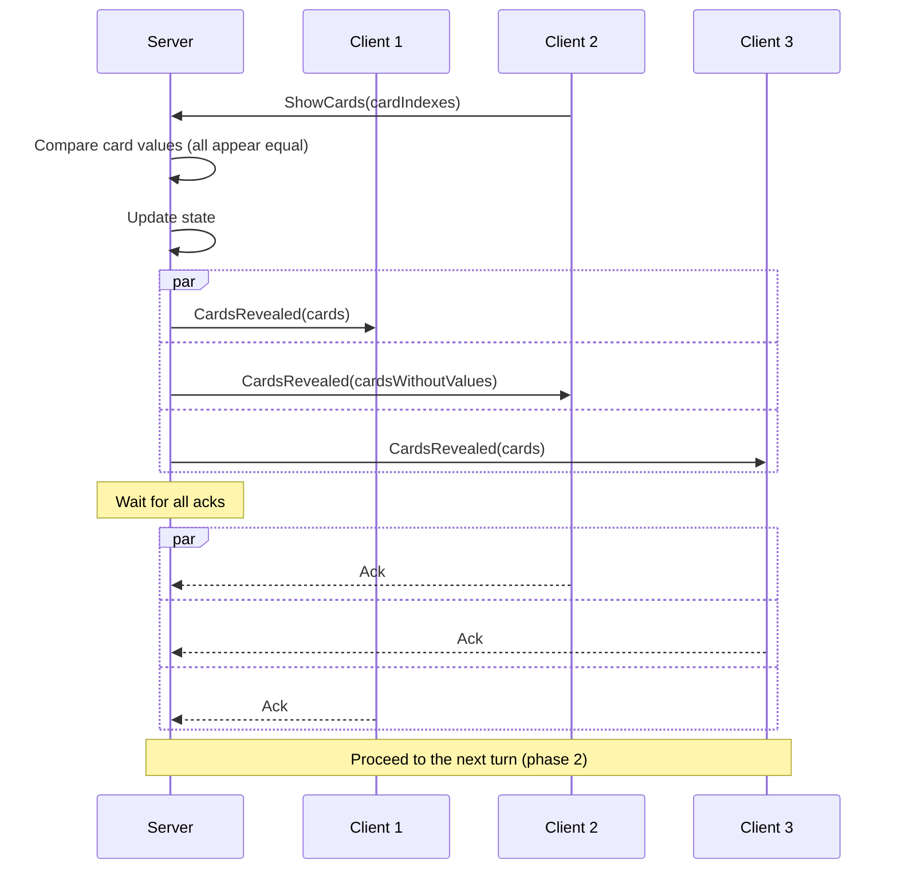
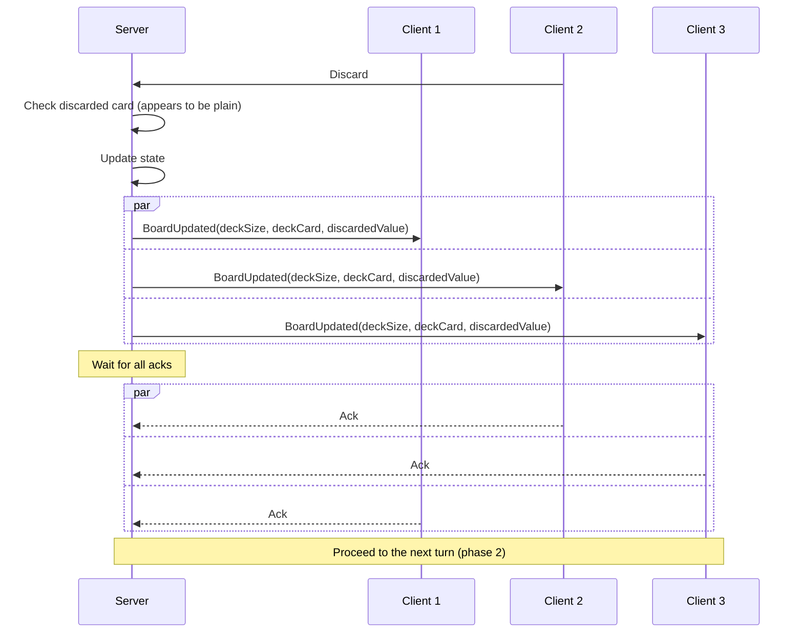
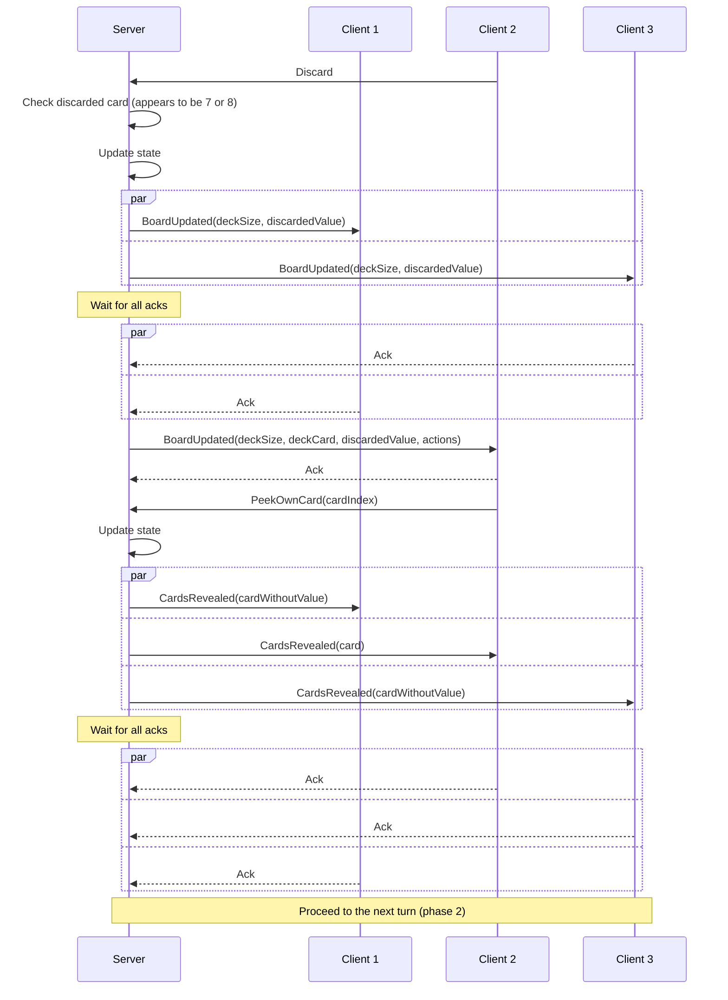
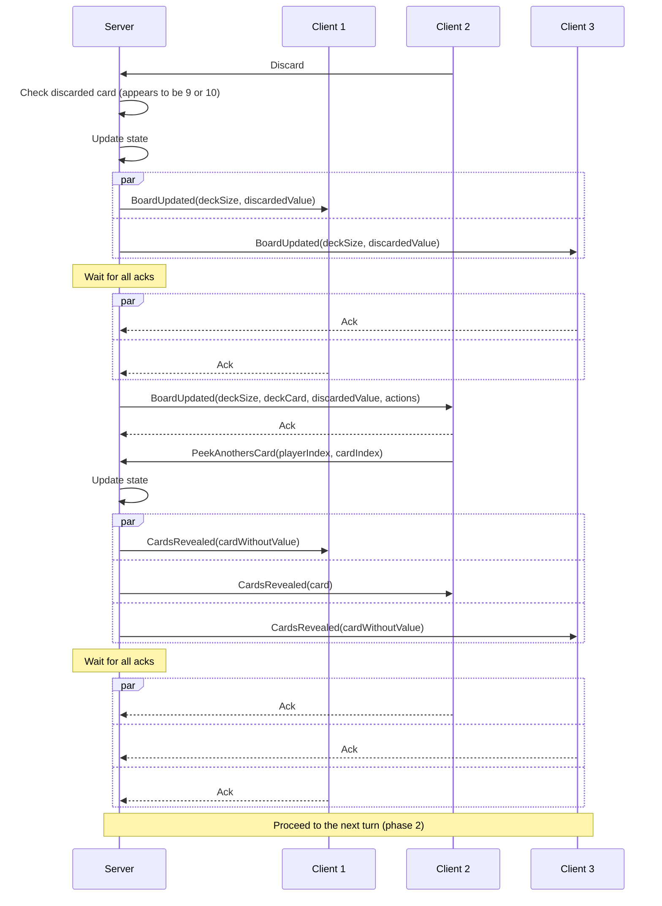
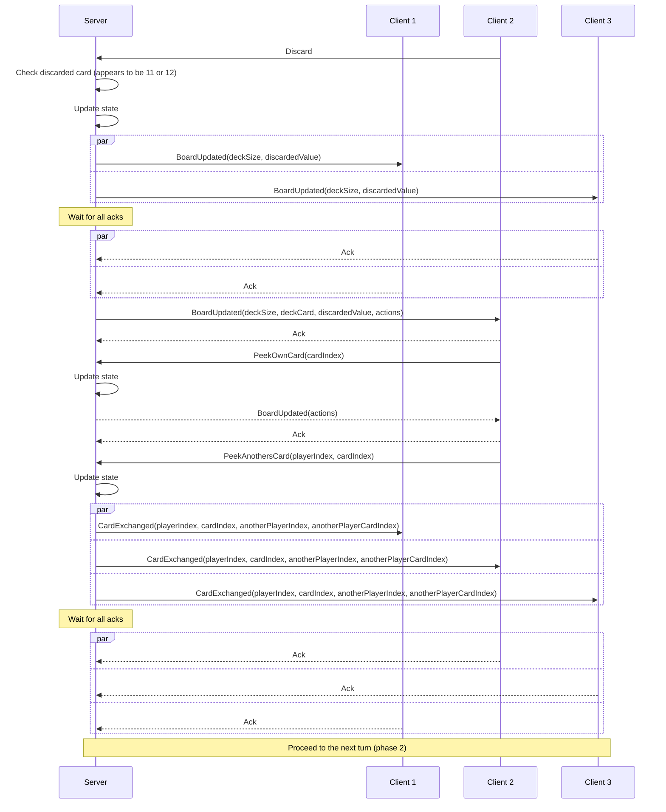

# Game states

# Client-server interaction protocol

## Phase 1 (round start)

Start a new round:

## Phase 2 (turn initiation)

Initiate a turn (select random player for the first one, the 2nd player is selected here):

## Phase 3 (initial card selection or stopping round)

Pick card from deck:

Pick the discarded card:

Stop the round:

## Phase 4a (replacing or identity testing)

Replace a card in player's hand by the picked card:

Claim to have two or more identical cards and succeed:

Claim to have two or more identical cards and fail:

## Phase 4b (discarding)

Discard the picked card (simple):

Discard the picked card (7 or 8):

Discard the picked card (9 or 10):

Discard the picked card (11 or 12):

## Phase 5 (finish round)

Round is finished, but the game will continue:

Game is finished:

