# Non-gameplay infrastructure

## Game states

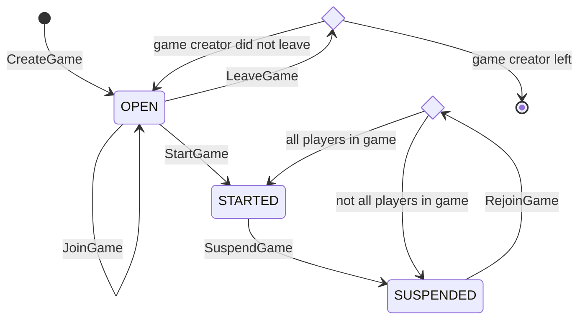

## Client-server interaction protocol

Assuming that 3 clients are connected to server.

### Player operations

Register a new player:
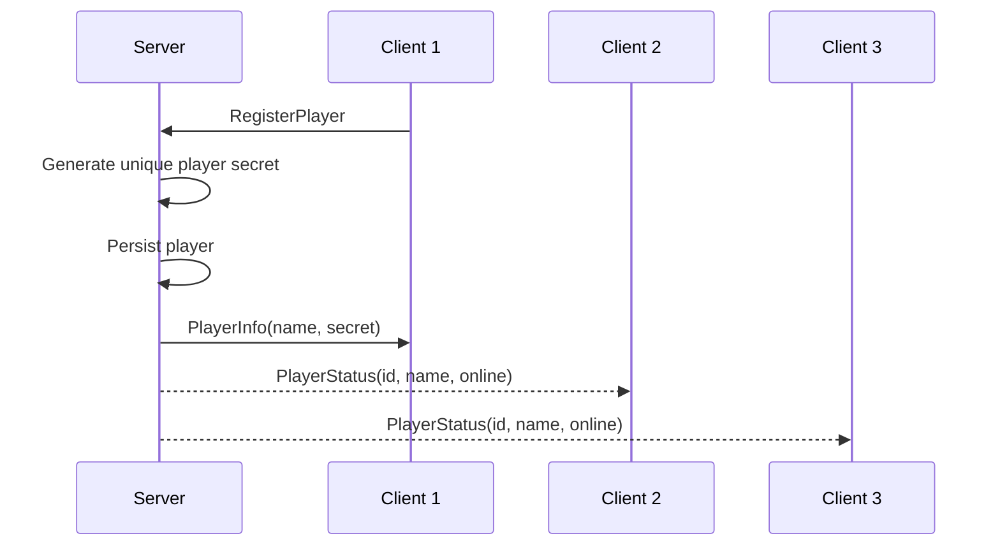

Rename a player:
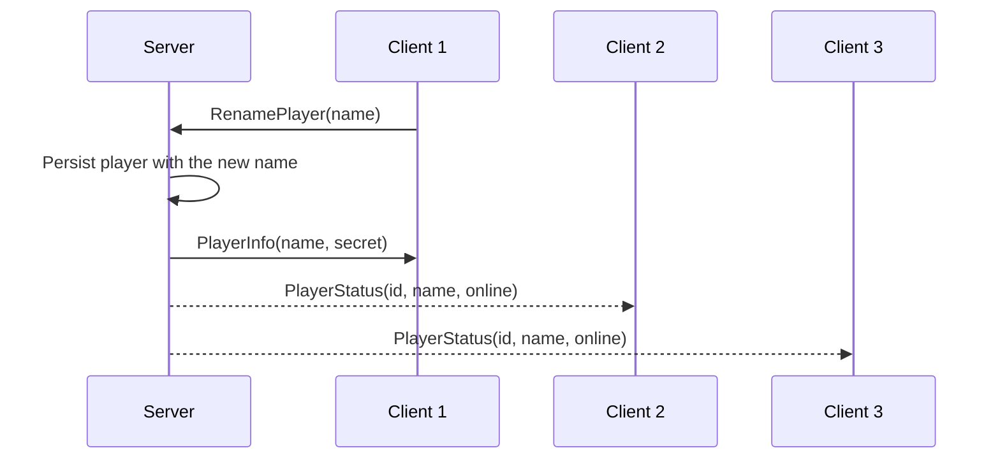

### Listing entities

List online players:
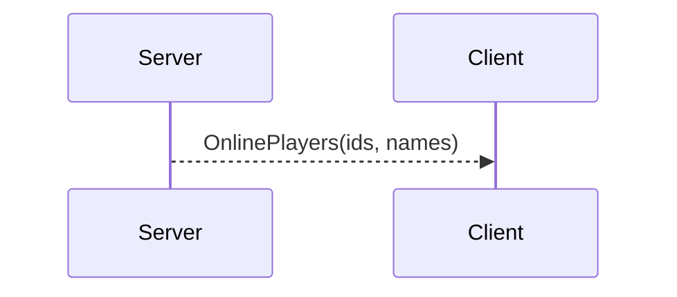

List open games:
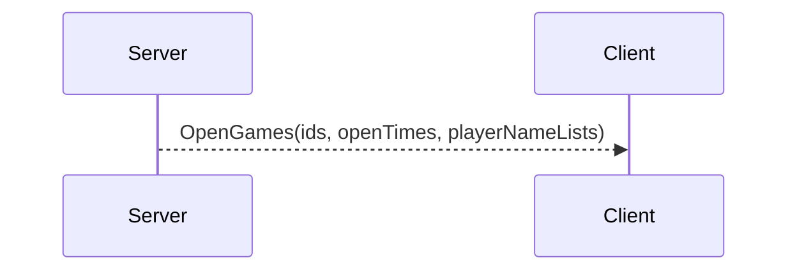

List suspended games:
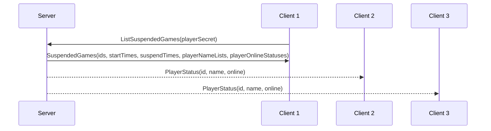

### Game lobby operations

Assuming player 1 creates the game, player 2 joins it, and player 3 is only connected to server.

Create a game:
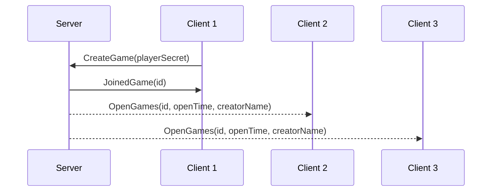

Join a game:
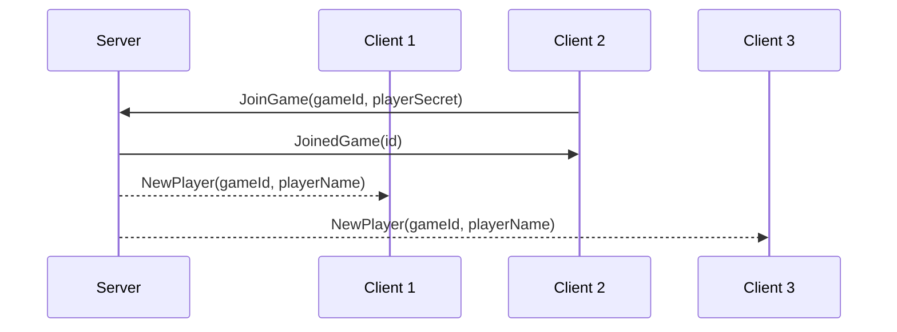

Abandon a game:
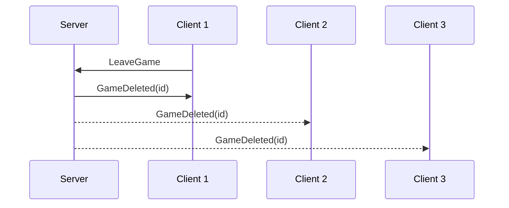

Leave an open game:
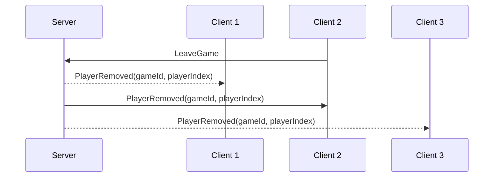

Start a game:
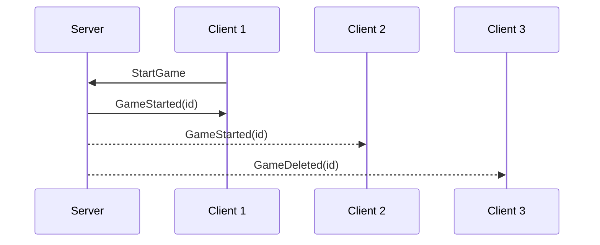

### Game operations

Assuming players 1 and 2 are in the game, and player 3 is only connected to server.

Suspend a started game:
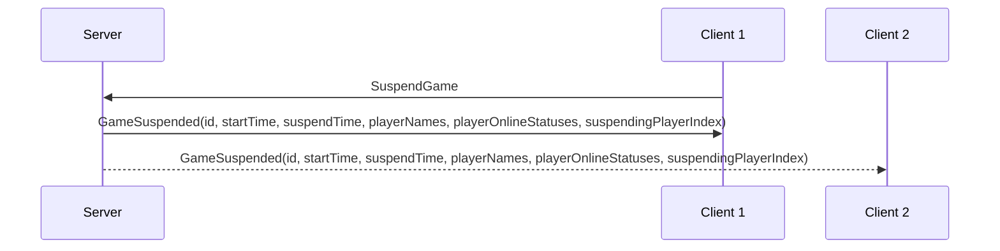

Leave a suspended game:
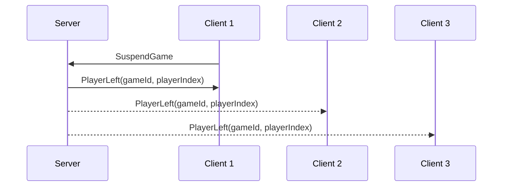

Rejoin a game (all other players are already in the game):
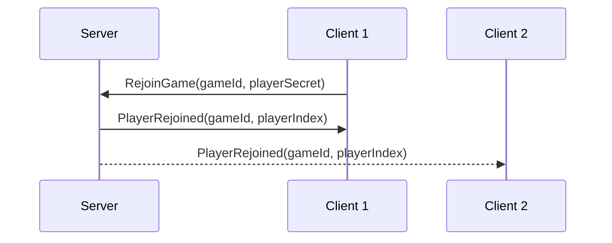

Rejoin a game (some other players did not rejoin yet):
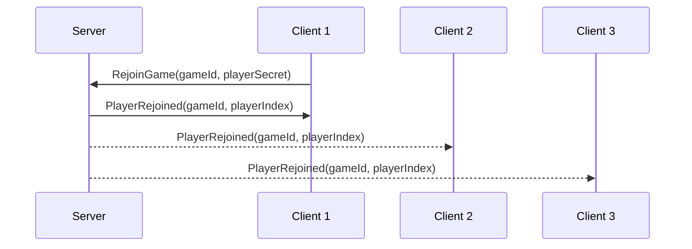
