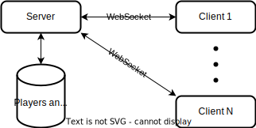

# Overview

The 66 game is an online multiplayer implementation of a turn-based board game with cards.
2 to 5 people can play together; no AI players are currently supported. Only web-client is available at the moment.

# Architecture

## High-level view

The game is built as a classic client-server application:

The server is written in Kotlin. WebSocket messaging is implemented on top of the coroutine-based Ktor library. To keep things simple, all messages are in plain JSON format.

The game uses CouchDB to store data. This choice is also inspired by simplicity considerations in the absence of strict performance requirements.

Client is implemented as a web application on JavaScript. It utilizes Vue.js for lobby screens and Rive library for in-game rendering and animations.

## Notable design details

### Lightweight registration of players

If the client is run for the first time on a particular device and browser, a player is required to enter a name. When the name is entered, the server generates and sends a unique secret key to the client, and persists the player data.
This secret and the player's name are persisted in the browser's local storage and used for subsequent transparent sign-ins.

### Game logic on server-side

While the client handles all UI and animation, it is kept "thin" in the gameplay logic aspect. This allows to avoid duplication of game logic with a cost of slightly higher network traffic.
The server explicitly sends all data relevant to a player at every particular stage of the game, even if some data can be determined by client side from historical data. This includes the list of actions available to each player in every game state.

### Players' view completeness

For a correct and fair game experience, the application must ensure that every player sees all relevant in-game events. This applies even in case of disconnection or suspending the game at any moment.

To achieve this, the client acknowledges every in-game notification received from the server after displaying the new state. The server waits for acks from all clients before proceeding to the next state.

More details on game states and communication can be found [here](GAME.md).

### Game suspension and resuming

A player can leave the game at any time and resume playing later. This can also happen as a result of disconnecting from the server due to network issues.
When any player leaves the game or disconnects, the game gets suspended: other players cannot see the game state or make moves until all players are back in the game.

This feature is made possible by persisting every state change on the server side. Even if the server goes down, it will load the current state for every game after restarting.
When a game is resumed, it starts from the current state and sends the necessary updates to clients, even if the updates were sent before suspending the game, but not all of them have been acknowledged.

More details on game lobby design can be found [here](LOBBY.md).

### Preventing cheating

Since knowing own or other players' cards can give a significant advantage, it is crucial to expose only information that a player is entitled to see.

As a ground rule, the server sends to each client only the data that is supposed to be seen by the corresponding player. This prevents cheating using a modified client.

To prevent someone with direct access to the database from seeing or modifying any card values, all sensitive data is encrypted using the secret keys of all players in the game. Since each key is only persisted on the client side, game data cannot be decrypted until all players provide their keys to the server.

### Persistence strategy

The server uses a write-through persistence strategy:
* Every update of a persistable entity (a game or a player) is propagated to the database.
* All entities are loaded from the database at the server start-up.
